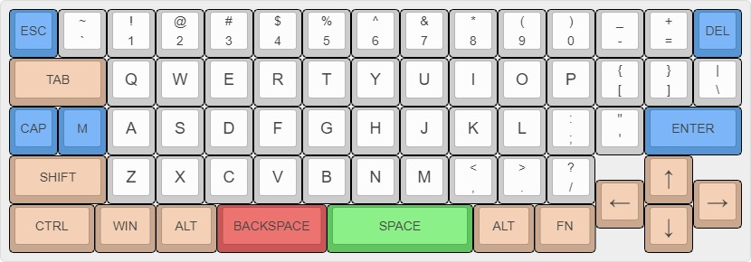

# legshark65

> Version 2.1



65% ortholinear keyboard using STM32 controller.

The purpose of this keyboard is contain all of the features I would like to have in an ortholinear keyboard (in order of importance):

- `Escape` in the top-left, `Delete` in the top-right, `Right Arrow` in the bottom-right, and `Control` in the bottom-left.
- Larger sized commonly-used modifier keys (fat finger complex).
- Offset to easily distinguish the arrow keys (fatter finger complex).
- Unevenly-split and centered spacebar. The main reason for this is to allow for easier reach to the spacebar from the right side of board.
- 

<details>
  <summary>Keyboard Layout Editor</summary>

	```js
		[{c:"#5795d4",t:"#383838",st:"KS-3-Tea",a:7,f:4},"ESC",{c:"#cccccc",a:5},"~\n`","!\n1","@\n2","#\n3","$\n4","%\n5","^\n6","&\n7","*\n8","(\n9",")\n0","_\n-","+\n=",{c:"#5795d4",a:7},"DEL"],
		[{c:"#c9a88f",w:2},"TAB",{c:"#cccccc",f:6},"Q","W","E","R","T","Y","U","I","O","P",{a:5,f:4},"{\n[","}\n]","|\n\\"],
		[{c:"#5795d4",a:7},"CAP","M",{c:"#cccccc",f:6},"A","S","D","F","G","H","J","K","L",{a:5,f:4},":\n;","\"\n'",{c:"#5795d4",a:7,w:2},"ENTER"],
		[{c:"#c9a88f",w:2},"SHIFT",{c:"#cccccc",f:6},"Z","X","C","V","B","N","M",{a:5,f:4},"<\n,",">\n.","?\n/",{x:1,c:"#c9a88f",a:7,f:9},"↑"],
		[{y:-0.5,x:12},"←",{x:1},"→"],
		[{y:-0.5,f:4,w:1.75},"CTRL",{w:1.25},"WIN",{w:1.25},"ALT",{c:"#cc5656",w:2.25},"BACKSPACE",{c:"#60c560",w:3},"SPACE",{c:"#c9a88f",w:1.25},"ALT",{w:1.25},"FN",{x:1,f:9},"↓"]

	```
</details>