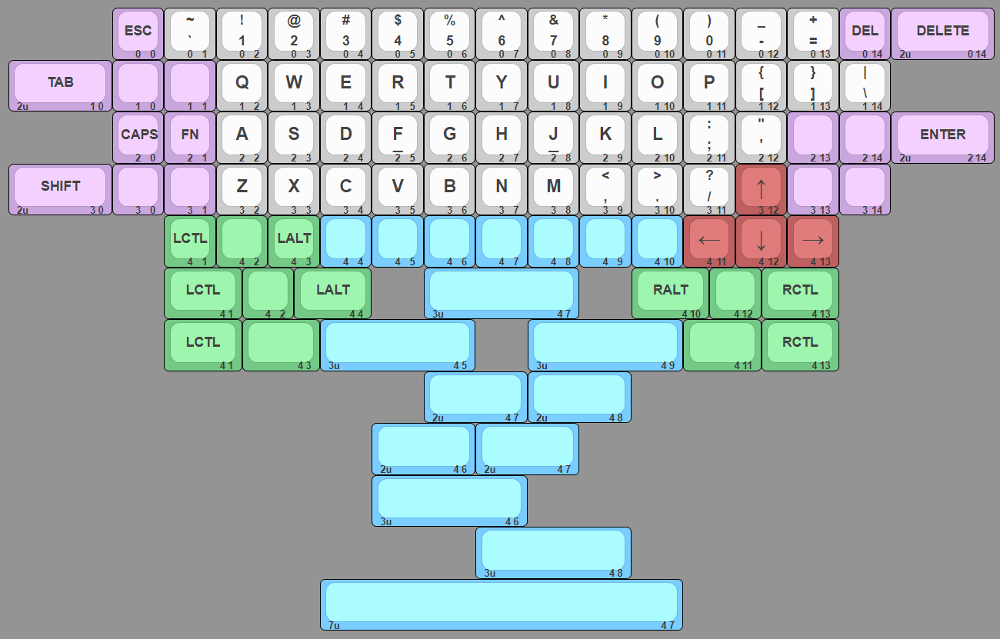
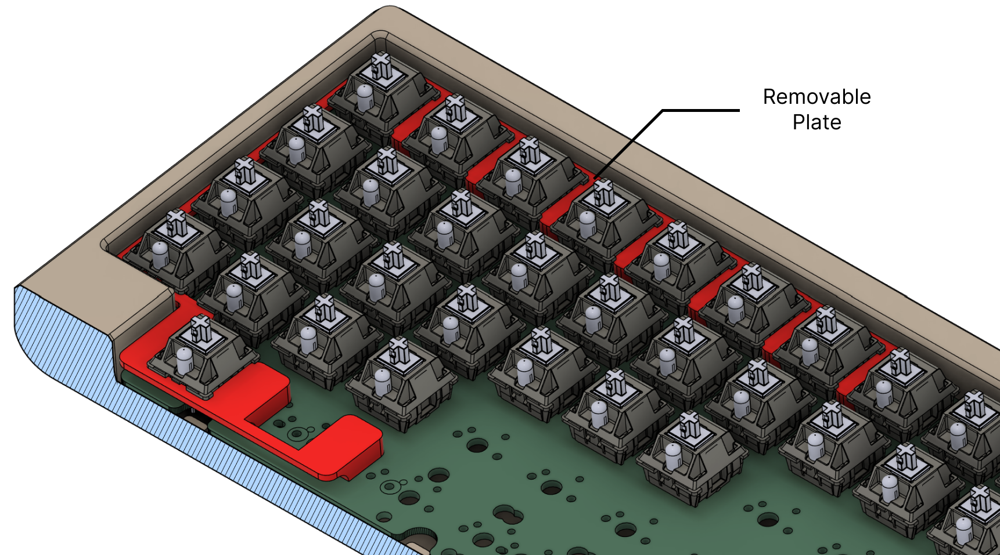
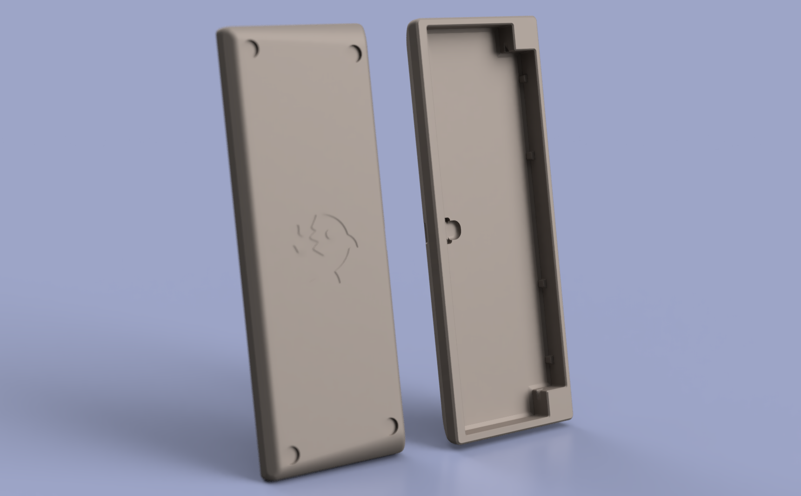

# Legshark

Legshark is a open source 60% (15 by 5) ortholinear keyboard designed with both flexability and familiarity in mind.

## Overview

- Highly customizable 60% ortho layout
- "Plateless" o-ring mounting
- 3D printable case
- [UDB](https://github.com/Unified-Daughterboard/) Support

### Layout

The PCB supports many different layout options for the bottom row, embracing `1u` keys but also with some left and right `1.5u` modifier options.

The board also supports use of `2u` keys in the usual `TAB`, `LSHIFT`, `DELETE`, and `ENTER` locations to maintain familiarity and speed with these often used modifiers.



### PCB

> NOTE: It is recommended to use screw-in stabilizers (yes they work with o-ring) due to clip-ins sometimes slipping between the three holes in the bottom row. I have slightly reduced the clip-in hole size which has mitigated the issue, but made them quite hard to push in.


>_These images may not be up-to-date._

Supports the [Unified Daughterboard](https://github.com/Unified-Daughterboard/).

### Mounting Style

Supports a unique "plateless" o-ring mounting style. The PCB also has through-holes for plate mounting should that be preferred.

#### "Plateless" o-ring plate

The "plateless" o-ring mounting style lets you enjoy the unique characteristics and sound of a platless + o-ring board with the added benefit of being able to remove/change the plate after soldering in the switches.

The printable plate files can be found in `./stls`. There are two files, one for `1.5u` spaced switches (pictured) and one for the `1u` spaced switches. Only the left side plate is supplied, you will need to vertically mirror the file in your slicer to print the right side. The optimal printing orientation is upside-down.



>NOTE: If you intend to use a layout with the `2u` SHIFT or DELETE keys these plates may need modified in order to fit the stabs.

### Case

Files for printing the case can be found in `./stls`. The print has been split into two parts, since it is too large for standard-sized printer volumes. The two halves are designed to be glued together using key and slot guides for alignment and added strength. The optimal printing orientation is vertically with the case-sides facing down.

>NOTE: I recommend using superglue to bond the two halves together.
>1) Glue all three keys into the slots of one of the halves. 
>2) Add glue along the mating surface and in the slots of the other half. 
>3) Carefully slide the two halves together using the keys and slots a guide. 
>4) Clamp the halves together and let the glue dry for 10-20 minutes.



### QMK

There is only one keymap avaliable for the keyboard currently. This keyboard has not been merged into the qmk repo yet. The firmware will need to be compiled and uploaded locally using [QMK](https://qmk.fm/). 

Copy `./qmk/keyboards` into your `/qmk_firmware` folder then run the following command to compile the firmware:
```
qmk compile -kb legshark/rev2 -km default
```

>NOTE: You will need to modify the keymaps to support different layouts!

### Keyboard Layout Editor:

```
[{x:2,c:"#c9a6de",t:"#383838",st:"KS-3-Tea",a:3,f:4},"ESC\n\n\n\n\n0\n\n\n\n\n\n0",{c:"#cccccc",a:1},"~\n`\n\n\n\n1\n\n\n\n\n\n0","!\n1\n\n\n\n2\n\n\n\n\n\n0","@\n2\n\n\n\n3\n\n\n\n\n\n0","#\n3\n\n\n\n4\n\n\n\n\n\n0","$\n4\n\n\n\n5\n\n\n\n\n\n0","%\n5\n\n\n\n6\n\n\n\n\n\n0","^\n6\n\n\n\n7\n\n\n\n\n\n0","&\n7\n\n\n\n8\n\n\n\n\n\n0","*\n8\n\n\n\n9\n\n\n\n\n\n0","(\n9\n\n\n\n10\n\n\n\n\n\n0",")\n0\n\n\n\n11\n\n\n\n\n\n0","_\n-\n\n\n\n12\n\n\n\n\n\n0","+\n=\n\n\n\n13\n\n\n\n\n\n0",{c:"#c9a6de",a:3},"DEL\n\n\n\n\n14\n\n\n\n\n\n0",{w:2},"DELETE\n\n\n\n2u\n0 14"],
[{w:2},"TAB\n\n\n\n2u\n1 0","\n\n\n\n\n0\n\n\n\n\n\n1","\n\n\n\n\n1\n\n\n\n\n\n1",{c:"#cccccc",f:6},"Q\n\n\n\n\n2\n\n\n\n\n\n1","W\n\n\n\n\n3\n\n\n\n\n\n1","E\n\n\n\n\n4\n\n\n\n\n\n1","R\n\n\n\n\n5\n\n\n\n\n\n1","T\n\n\n\n\n6\n\n\n\n\n\n1","Y\n\n\n\n\n7\n\n\n\n\n\n1","U\n\n\n\n\n8\n\n\n\n\n\n1","I\n\n\n\n\n9\n\n\n\n\n\n1","O\n\n\n\n\n10\n\n\n\n\n\n1","P\n\n\n\n\n11\n\n\n\n\n\n1",{a:1,f:4},"{\n[\n\n\n\n12\n\n\n\n\n\n1","}\n]\n\n\n\n13\n\n\n\n\n\n1","|\n\\\n\n\n\n14\n\n\n\n\n\n1"],
[{x:2,c:"#c9a6de",a:3},"CAPS\n\n\n\n\n0\n\n\n\n\n\n2","FN\n\n\n\n\n1\n\n\n\n\n\n2",{c:"#cccccc",f:6},"A\n\n\n\n\n2\n\n\n\n\n\n2","S\n\n\n\n\n3\n\n\n\n\n\n2","D\n\n\n\n\n4\n\n\n\n\n\n2",{a:1},"\n_\n\n\n\n5\nF\n\n\n\n\n2",{a:3},"G\n\n\n\n\n6\n\n\n\n\n\n2","H\n\n\n\n\n7\n\n\n\n\n\n2",{a:1},"\n_\n\n\n\n8\nJ\n\n\n\n\n2",{a:3},"K\n\n\n\n\n9\n\n\n\n\n\n2","L\n\n\n\n\n10\n\n\n\n\n\n2",{a:1,f:4},":\n;\n\n\n\n11\n\n\n\n\n\n2","\"\n'\n\n\n\n12\n\n\n\n\n\n2",{c:"#c9a6de",a:3},"\n\n\n\n\n13\n\n\n\n\n\n2","\n\n\n\n\n14\n\n\n\n\n\n2",{w:2},"ENTER\n\n\n\n2u\n2 14"],
[{w:2},"SHIFT\n\n\n\n2u\n3 0","\n\n\n\n\n0\n\n\n\n\n\n3","\n\n\n\n\n1\n\n\n\n\n\n3",{c:"#cccccc",f:6},"Z\n\n\n\n\n2\n\n\n\n\n\n3","X\n\n\n\n\n3\n\n\n\n\n\n3","C\n\n\n\n\n4\n\n\n\n\n\n3","V\n\n\n\n\n5\n\n\n\n\n\n3","B\n\n\n\n\n6\n\n\n\n\n\n3","N\n\n\n\n\n7\n\n\n\n\n\n3","M\n\n\n\n\n8\n\n\n\n\n\n3",{a:1,f:4},"<\n,\n\n\n\n9\n\n\n\n\n\n3",">\n.\n\n\n\n10\n\n\n\n\n\n3","?\n/\n\n\n\n11\n\n\n\n\n\n3",{c:"#bf6060",a:3,f:9},"↑\n\n\n\n\n12\n\n\n\n\n\n3",{c:"#c9a6de",f:4},"\n\n\n\n\n13\n\n\n\n\n\n3","\n\n\n\n\n14\n\n\n\n\n\n3"],
[{x:3,c:"#73c985"},"LCTL\n\n\n\n\n1\n\n\n\n\n\n4","\n\n\n\n\n2\n\n\n\n\n\n4","LALT\n\n\n\n\n3\n\n\n\n\n\n4",{c:"#7acdff",sm:"alps"},"\n\n\n\n\n4\n\n\n\n\n\n4","\n\n\n\n\n5\n\n\n\n\n\n4","\n\n\n\n\n6\n\n\n\n\n\n4","\n\n\n\n\n7\n\n\n\n\n\n4","\n\n\n\n\n8\n\n\n\n\n\n4","\n\n\n\n\n9\n\n\n\n\n\n4","\n\n\n\n\n10\n\n\n\n\n\n4",{c:"#bf6060",f:9},"←\n\n\n\n\n11\n\n\n\n\n\n4","↓\n\n\n\n\n12\n\n\n\n\n\n4","→\n\n\n\n\n13\n\n\n\n\n\n4"],
[{x:3,c:"#73c985",f:4,w:1.5},"LCTL\n\n\n\n\n4 1","\n\n\n\n\n2\n\n\n\n\n\n4",{w:1.5},"LALT\n\n\n\n\n4 4",{x:1,c:"#7acdff",w:3},"\n\n\n\n3u\n4 7",{x:1,c:"#73c985",w:1.5},"RALT\n\n\n\n\n4 10","\n\n\n\n\n4 12",{w:1.5},"RCTL\n\n\n\n\n4 13"],
[{x:3,w:1.5},"LCTL\n\n\n\n\n4 1",{w:1.5},"\n\n\n\n\n4 3",{c:"#7acdff",w:3},"\n\n\n\n3u\n4 5",{x:1,w:3},"\n\n\n\n3u\n4 9",{c:"#73c985",w:1.5},"\n\n\n\n\n4 11",{w:1.5},"RCTL\n\n\n\n\n4 13"],
[{x:8,c:"#7acdff",w:2},"\n\n\n\n2u\n4 7",{w:2},"\n\n\n\n2u\n4 8"],
[{x:7,w:2},"\n\n\n\n2u\n4 6",{w:2},"\n\n\n\n2u\n4 7"],
[{x:7,w:3},"\n\n\n\n3u\n4 6"],
[{x:9,w:3},"\n\n\n\n3u\n4 8"],
[{x:6,w:7},"\n\n\n\n7u\n4 7"]
```
# Liability

This open source hardware is provided as is and can not be held accountable for any damages and/or liabilities caused as a result of whatever you intend to use it for.
