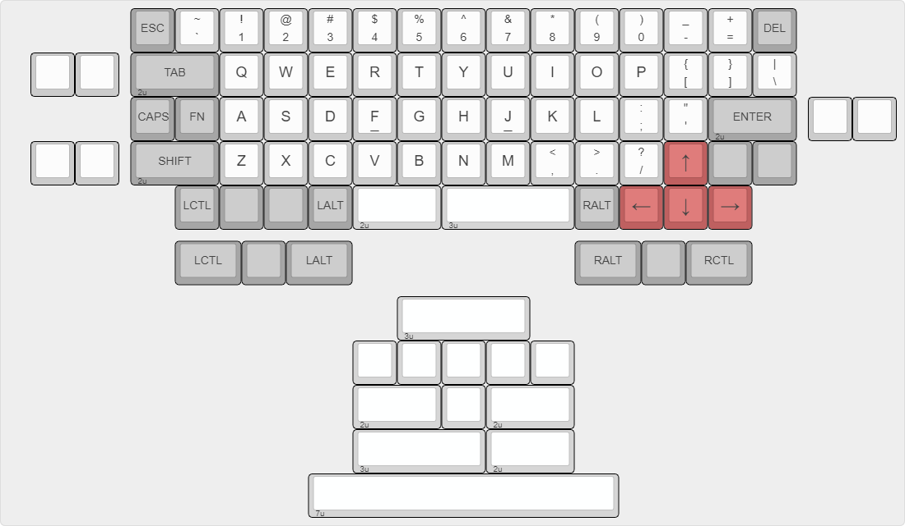
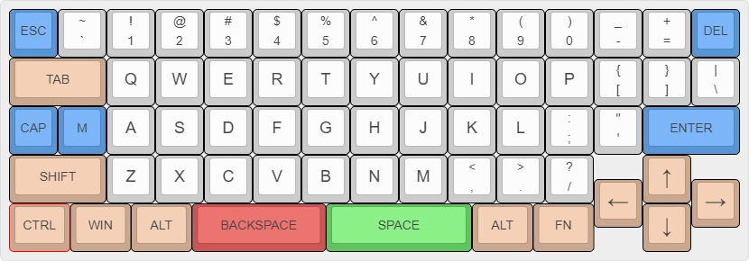

# legshark65

65% ortholinear keyboard using STM32 controller.

> Revision 2



Revision 2 will bring more customizable layout options and various optimizaitons over the original board.

The purpose of this keyboard is contain all of the features I would like to have in an ortholinear keyboard (in order of importance):

- `Escape` in the top-left, `Delete` in the top-right, `Right Arrow` in the bottom-right, and `Control` in the bottom-left.
- Larger sized commonly-used modifier keys (fat finger complex).
- Offset to easily distinguish the arrow keys (fatter finger complex).
- Unevenly-split and centered spacebar. The main reason for this is to allow for easier reach to the spacebar from the right side of board. 

<details>
  <summary>KLE Layout</summary>

	[{x:2.25,c:"#5795d4",t:"#383838",st:"KS-3-Tea",a:7,f:4},"ESC",{c:"#cccccc",a:5},"~\n`","!\n1","@\n2","#\n3","$\n4","%\n5","^\n6","&\n7","*\n8","(\n9",")\n0","_\n-","+\n=",{c:"#5795d4",a:7},"DEL"],
	[{c:"#cccccc"},"","",{x:0.25,c:"#c9a88f",w:2},"TAB",{c:"#cccccc",f:6},"Q","W","E","R","T","Y","U","I","O","P",{a:5,f:4},"{\n[","}\n]","|\n\\"],
	[{c:"#c9a88f",a:7,w:2,d:true},"<p>alternative tab</p>",{x:0.25,c:"#5795d4"},"CAP","L1",{c:"#cccccc",f:6},"A","S","D","F","G","H","J","K","L",{a:5,f:4},":\n;","\"\n'",{c:"#5795d4",a:7,w:2},"ENTER",{x:0.25,c:"#cccccc"},"",""],
	["","",{x:0.25,c:"#c9a88f",w:2},"SHIFT",{c:"#cccccc",f:6},"Z","X","C","V","B","N","M",{a:5,f:4},"<\n,",">\n.","?\n/",{a:7},"",{c:"#c9a88f",f:9},"↑",{c:"#cccccc",f:4},"",{x:0.25,c:"#c9a88f",w:2,d:true},"<p>alternative enter</p>"],
	[{w:2,d:true},"<p>alternative shift</p>",{x:0.25,w:1.25},"CTRL",{w:1.25},"WIN",{w:1.25},"ALT",{c:"#cc5656",w:2.75},"BACKSPACE",{c:"#d6d6d6",w:3},"SPACE",{c:"#c9a88f",w:1.25},"ALT",{w:1.25},"FN",{f:9},"←","↓","→"],
	[{y:0.25,x:6,c:"#d6d6d6",f:4,w:7},"SPACE",{c:"#c9a88f",w:1.25},"ALT",{x:1,f:9},"↑"],
	[{y:-0.5,x:4,f:4,w:2,d:true},"<p>alternative space bars</p>",{x:8.25,f:9},"←",{x:1},"→",{f:4,w:2,d:true},"<p>alternative arrow keys</p>"],
	[{y:-0.5,x:6,c:"#d6d6d6",w:6.25},"SPACE",{c:"#c9a88f",w:1.25},"ALT",{x:1.75,f:9},"↓"]
</details>

---
## Legacy
## Revision 1



<details>
  <summary>Keyboard Layout Editor</summary>

	[{c:"#5795d4",t:"#383838",st:"KS-3-Tea",a:7,f:4},"ESC",{c:"#cccccc",a:5},"~\n`","!\n1","@\n2","#\n3","$\n4","%\n5","^\n6","&\n7","*\n8","(\n9",")\n0","_\n-","+\n=",{c:"#5795d4",a:7},"DEL"],
	[{c:"#c9a88f",w:2},"TAB",{c:"#cccccc",f:6},"Q","W","E","R","T","Y","U","I","O","P",{a:5,f:4},"{\n[","}\n]","|\n\\"],
	[{c:"#5795d4",a:7},"CAP","M",{c:"#cccccc",f:6},"A","S","D","F","G","H","J","K","L",{a:5,f:4},":\n;","\"\n'",{c:"#5795d4",a:7,w:2},"ENTER"],
	[{c:"#c9a88f",w:2},"SHIFT",{c:"#cccccc",f:6},"Z","X","C","V","B","N","M",{a:5,f:4},"<\n,",">\n.","?\n/",{x:1,c:"#c9a88f",a:7,f:9},"↑"],
	[{y:-0.5,x:12},"←",{x:1},"→"],
	[{y:-0.5,f:4,w:1.25},"CTRL",{w:1.25},"WIN",{w:1.25},"ALT",{c:"#cc5656",w:2.75},"BACKSPACE",{c:"#60c560",w:3},"SPACE",{c:"#c9a88f",w:1.25},"ALT",{w:1.25},"FN",{x:1,f:9},"↓"]
</details>


```
#define LAYOUT( \
	K000, K001, K002, K003, K004, K005, K006, K007, K008, K009, K010, K011, K012, K013, K014, \
	      K101, K102, K103, K104, K105, K106, K107, K108, K109, K110, K111, K112, K113, K114, \
	K200, K201, K202, K203, K204, K205, K206, K207, K208, K209, K210, K211, K212,       K214, \
	      K301, K302, K303, K304, K305, K306, K307, K308, K309, K310, K311,       K313,       \
	K400,       K402, K403,       K405,             K408,       K410, K411, K412, K413, K414  \
) { \
	{ K000,  K001,  K002,  K003,  K004,  K005,  K006,  K007,  K008,  K009,  K010,  K011,  K012,  K013,  K014 }, \
	{ KC_NO, K101,  K102,  K103,  K104,  K105,  K106,  K107,  K108,  K109,  K110,  K111,  K112,  K113,  K114 }, \
	{ K200,  K201,  K202,  K203,  K204,  K205,  K206,  K207,  K208,  K209,  K210,  K211,  K212,  KC_NO, K214 }, \
	{ KC_NO, K301,  K302,  K303,  K304,  K305,  K306,  K307,  K308,  K309,  K310,  K311,  KC_NO, K313,  KC_NO }, \
	{ K400,  KC_NO, K402,  K403,  KC_NO, K405,  KC_NO, KC_NO, K408,  KC_NO, K410,  K411,  K412,  K413,  K414 }  \
}
```