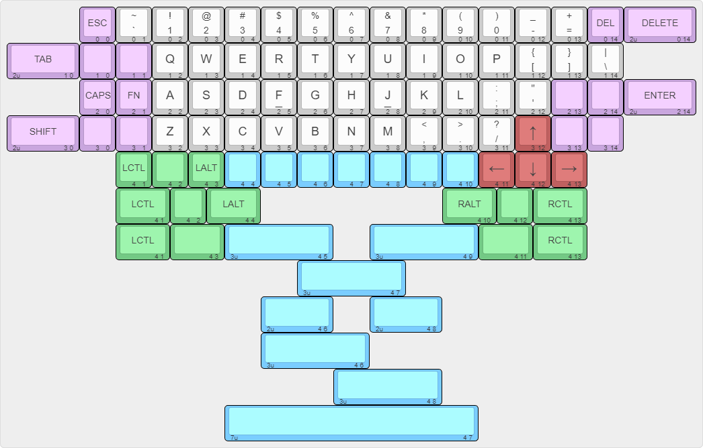
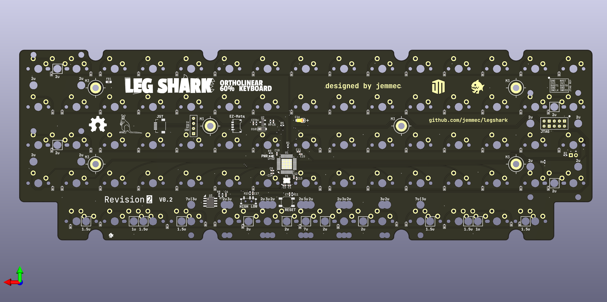

# legshark65

65% ortholinear keyboard using STM32 controller.

> Revision 2






Revision 2 will bring more customizable layout options and various optimizaitons over the original board. It will also change the layout to be more aesthetic and symetrical than it's predecesor.

The purpose of this keyboard is contain all of the features I would like to have in an ortholinear keyboard (in order of importance):

- `Escape` in the top-left, `Delete` in the top-right, `Right Arrow` in the bottom-right, and `Control` in the bottom-left.
- Larger sized commonly-used modifier keys (fat finger complex).
- Offset to easily distinguish the arrow keys (fatter finger complex).
- Unevenly-split and centered spacebar. The main reason for this is to allow for easier reach to the spacebar from the right side of board. 

## Keyboard Layout Editor:

```
[{x:2,c:"#c9a6de",t:"#383838",st:"KS-3-Tea",a:3,f:4},"ESC\n\n\n\n\n0\n\n\n\n\n\n0",{c:"#cccccc",a:1},"~\n`\n\n\n\n1\n\n\n\n\n\n0","!\n1\n\n\n\n2\n\n\n\n\n\n0","@\n2\n\n\n\n3\n\n\n\n\n\n0","#\n3\n\n\n\n4\n\n\n\n\n\n0","$\n4\n\n\n\n5\n\n\n\n\n\n0","%\n5\n\n\n\n6\n\n\n\n\n\n0","^\n6\n\n\n\n7\n\n\n\n\n\n0","&\n7\n\n\n\n8\n\n\n\n\n\n0","*\n8\n\n\n\n9\n\n\n\n\n\n0","(\n9\n\n\n\n10\n\n\n\n\n\n0",")\n0\n\n\n\n11\n\n\n\n\n\n0","_\n-\n\n\n\n12\n\n\n\n\n\n0","+\n=\n\n\n\n13\n\n\n\n\n\n0",{c:"#c9a6de",a:3},"DEL\n\n\n\n\n14\n\n\n\n\n\n0",{w:2},"DELETE\n\n\n\n2u\n0 14"],
[{w:2},"TAB\n\n\n\n2u\n1 0","\n\n\n\n\n0\n\n\n\n\n\n1","\n\n\n\n\n1\n\n\n\n\n\n1",{c:"#cccccc",f:6},"Q\n\n\n\n\n2\n\n\n\n\n\n1","W\n\n\n\n\n3\n\n\n\n\n\n1","E\n\n\n\n\n4\n\n\n\n\n\n1","R\n\n\n\n\n5\n\n\n\n\n\n1","T\n\n\n\n\n6\n\n\n\n\n\n1","Y\n\n\n\n\n7\n\n\n\n\n\n1","U\n\n\n\n\n8\n\n\n\n\n\n1","I\n\n\n\n\n9\n\n\n\n\n\n1","O\n\n\n\n\n10\n\n\n\n\n\n1","P\n\n\n\n\n11\n\n\n\n\n\n1",{a:1,f:4},"{\n[\n\n\n\n12\n\n\n\n\n\n1","}\n]\n\n\n\n13\n\n\n\n\n\n1","|\n\\\n\n\n\n14\n\n\n\n\n\n1"],
[{x:2,c:"#c9a6de",a:3},"CAPS\n\n\n\n\n0\n\n\n\n\n\n2","FN\n\n\n\n\n1\n\n\n\n\n\n2",{c:"#cccccc",f:6},"A\n\n\n\n\n2\n\n\n\n\n\n2","S\n\n\n\n\n3\n\n\n\n\n\n2","D\n\n\n\n\n4\n\n\n\n\n\n2",{a:1},"\n_\n\n\n\n5\nF\n\n\n\n\n2",{a:3},"G\n\n\n\n\n6\n\n\n\n\n\n2","H\n\n\n\n\n7\n\n\n\n\n\n2",{a:1},"\n_\n\n\n\n8\nJ\n\n\n\n\n2",{a:3},"K\n\n\n\n\n9\n\n\n\n\n\n2","L\n\n\n\n\n10\n\n\n\n\n\n2",{a:1,f:4},":\n;\n\n\n\n11\n\n\n\n\n\n2","\"\n'\n\n\n\n12\n\n\n\n\n\n2",{c:"#c9a6de",a:3},"\n\n\n\n\n13\n\n\n\n\n\n2","\n\n\n\n\n14\n\n\n\n\n\n2",{w:2},"ENTER\n\n\n\n2u\n2 14"],
[{w:2},"SHIFT\n\n\n\n2u\n3 0","\n\n\n\n\n0\n\n\n\n\n\n3","\n\n\n\n\n1\n\n\n\n\n\n3",{c:"#cccccc",f:6},"Z\n\n\n\n\n2\n\n\n\n\n\n3","X\n\n\n\n\n3\n\n\n\n\n\n3","C\n\n\n\n\n4\n\n\n\n\n\n3","V\n\n\n\n\n5\n\n\n\n\n\n3","B\n\n\n\n\n6\n\n\n\n\n\n3","N\n\n\n\n\n7\n\n\n\n\n\n3","M\n\n\n\n\n8\n\n\n\n\n\n3",{a:1,f:4},"<\n,\n\n\n\n9\n\n\n\n\n\n3",">\n.\n\n\n\n10\n\n\n\n\n\n3","?\n/\n\n\n\n11\n\n\n\n\n\n3",{c:"#bf6060",a:3,f:9},"↑\n\n\n\n\n12\n\n\n\n\n\n3",{c:"#c9a6de",f:4},"\n\n\n\n\n13\n\n\n\n\n\n3","\n\n\n\n\n14\n\n\n\n\n\n3"],
[{x:3,c:"#73c985"},"LCTL\n\n\n\n\n1\n\n\n\n\n\n4","\n\n\n\n\n2\n\n\n\n\n\n4","LALT\n\n\n\n\n3\n\n\n\n\n\n4",{c:"#7acdff",sm:"alps"},"\n\n\n\n\n4\n\n\n\n\n\n4","\n\n\n\n\n5\n\n\n\n\n\n4","\n\n\n\n\n6\n\n\n\n\n\n4","\n\n\n\n\n7\n\n\n\n\n\n4","\n\n\n\n\n8\n\n\n\n\n\n4","\n\n\n\n\n9\n\n\n\n\n\n4",{sm:""},"\n\n\n\n\n10\n\n\n\n\n\n4",{c:"#bf6060",f:9},"←\n\n\n\n\n11\n\n\n\n\n\n4","↓\n\n\n\n\n12\n\n\n\n\n\n4","→\n\n\n\n\n13\n\n\n\n\n\n4"],
[{x:3,c:"#73c985",f:4,w:1.5},"LCTL\n\n\n\n\n4 1","\n\n\n\n\n2\n\n\n\n\n\n4",{sm:"alps",w:1.5},"LALT\n\n\n\n\n4 4",{x:5,w:1.5},"RALT\n\n\n\n\n4 10",{sm:""},"\n\n\n\n\n4 12",{w:1.5},"RCTL\n\n\n\n\n4 13"],
[{x:3,w:1.5},"LCTL\n\n\n\n\n4 1",{w:1.5},"\n\n\n\n\n4 3",{c:"#7acdff",w:3},"\n\n\n\n3u\n4 5",{x:1,w:3},"\n\n\n\n3u\n4 9",{c:"#73c985",w:1.5},"\n\n\n\n\n4 11",{w:1.5},"RCTL\n\n\n\n\n4 13"],
[{x:8,c:"#7acdff",w:3},"\n\n\n\n3u\n4 7"],
[{x:7,w:2},"\n\n\n\n2u\n4 6",{x:1,w:2},"\n\n\n\n2u\n4 8"],
[{x:7,w:3},"\n\n\n\n3u\n4 6"],
[{x:9,w:3},"\n\n\n\n3u\n4 8"],
[{x:6,w:7},"\n\n\n\n7u\n4 7"]
```

---
## Legacy
## Revision 1


<details>
  <summary>Keyboard Layout Editor</summary>

	[{c:"#5795d4",t:"#383838",st:"KS-3-Tea",a:7,f:4},"ESC",{c:"#cccccc",a:5},"~\n`","!\n1","@\n2","#\n3","$\n4","%\n5","^\n6","&\n7","*\n8","(\n9",")\n0","_\n-","+\n=",{c:"#5795d4",a:7},"DEL"],
	[{c:"#c9a88f",w:2},"TAB",{c:"#cccccc",f:6},"Q","W","E","R","T","Y","U","I","O","P",{a:5,f:4},"{\n[","}\n]","|\n\\"],
	[{c:"#5795d4",a:7},"CAP","M",{c:"#cccccc",f:6},"A","S","D","F","G","H","J","K","L",{a:5,f:4},":\n;","\"\n'",{c:"#5795d4",a:7,w:2},"ENTER"],
	[{c:"#c9a88f",w:2},"SHIFT",{c:"#cccccc",f:6},"Z","X","C","V","B","N","M",{a:5,f:4},"<\n,",">\n.","?\n/",{x:1,c:"#c9a88f",a:7,f:9},"↑"],
	[{y:-0.5,x:12},"←",{x:1},"→"],
	[{y:-0.5,f:4,w:1.25},"CTRL",{w:1.25},"WIN",{w:1.25},"ALT",{c:"#cc5656",w:2.75},"BACKSPACE",{c:"#60c560",w:3},"SPACE",{c:"#c9a88f",w:1.25},"ALT",{w:1.25},"FN",{x:1,f:9},"↓"]
</details>


```
#define LAYOUT( \
	K000, K001, K002, K003, K004, K005, K006, K007, K008, K009, K010, K011, K012, K013, K014, \
	      K101, K102, K103, K104, K105, K106, K107, K108, K109, K110, K111, K112, K113, K114, \
	K200, K201, K202, K203, K204, K205, K206, K207, K208, K209, K210, K211, K212,       K214, \
	      K301, K302, K303, K304, K305, K306, K307, K308, K309, K310, K311,       K313,       \
	K400,       K402, K403,       K405,             K408,       K410, K411, K412, K413, K414  \
) { \
	{ K000,  K001,  K002,  K003,  K004,  K005,  K006,  K007,  K008,  K009,  K010,  K011,  K012,  K013,  K014 }, \
	{ KC_NO, K101,  K102,  K103,  K104,  K105,  K106,  K107,  K108,  K109,  K110,  K111,  K112,  K113,  K114 }, \
	{ K200,  K201,  K202,  K203,  K204,  K205,  K206,  K207,  K208,  K209,  K210,  K211,  K212,  KC_NO, K214 }, \
	{ KC_NO, K301,  K302,  K303,  K304,  K305,  K306,  K307,  K308,  K309,  K310,  K311,  KC_NO, K313,  KC_NO }, \
	{ K400,  KC_NO, K402,  K403,  KC_NO, K405,  KC_NO, KC_NO, K408,  KC_NO, K410,  K411,  K412,  K413,  K414 }  \
}
```
